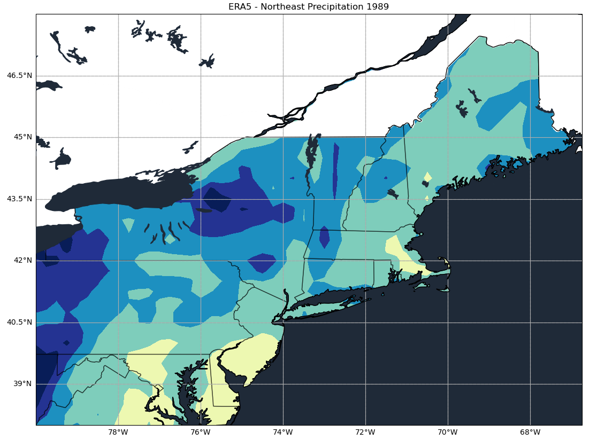
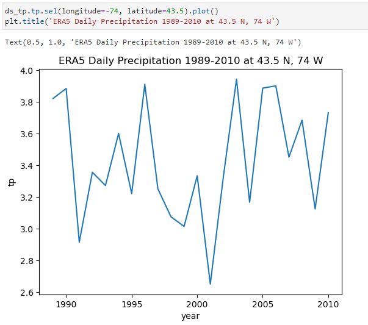

For my maps that show precipitation data, I have managed to mask out the data that was previously displayed within Canada. I accomplished this by the using the "ShapelyFeature" package within cartopy to import the Canada shape, and then assigning it the entire shape a white color so that it masks out the data within Canada.

This also works with my 12-Month Climatology Plot.

I have also started to put together some line plots that show total precipitation trends for specific locations within the Northeast U.S. The figure below displays this trend for 43.5 N 74 W.

Question: I have only been able to compute these plots for specific latitude and longitude values. How can I do this for latitude and longitude ranges (43-43.5 N, 74 - 72 W or even entire states)?
