# Northeast U.S. Precipitation Trends between 1990-2010

## Introduction

For my project, I will be exploring the total land precipitation trends within the Northeast United States through the years of 1990-2010. One of the most concerning aspects of climate change is how it will impact global weather patterns, and this is my main motivation in choosing precipitation as my research variable. My intention is to discover any conclusive changes in the Northeast U.S. on a recent scale, as this is a region with unusual patterns of precipitation compared to the rest of the U.S. This is mainly due to the Lake-Effect snowfall from the Great Lakes, as well as the strong and varied precipitation caused by the cold core cyclones that occur in the winter, known as "Nor'Easters." While I will not focus exclusively on winter, it will be the season that I give the greatest amount of attention within my analysis. In the end, I will make interpretations about my calculations in terms of how they relate to my intentions, and then form conclusions based on these interpretations.

## Data

My project will make use of the ERA5 Global Reanalysis, which is a data set that covers a massive amount of atmospheric and weather data, including precipitation and temperature data, which spans as far back as the mid-1900s (Hersbach et al, 2020). The ERA5 Global Reanalysis was created by the European Center for Medium-Range Weather Forecasts with a resolution of 0.25 Degrees, and is consistently updated with both new and changing atmospheric data (ECMWF, n.d.). Because of the size of this data set, I will only be working with northeast region of the U.S., while focusing on the variable of total precipitation (tp) between the years of 1990-2010. I chose the latitude and longitude ranges of -80W to -67.5W and 38N to 48N, which unfortunately contains data within Canada that I needed to mask out within my plots. The precipitation values compiled in my dataset are categorized as m/day, and I changed them to values of mm/day by multiplying the precipitation values by 1000. For my composite, I will use the North Atlantic Oscillation (NAO) climate index with my dataset. I chose this index because the NAO occurs near the Northeast U.S., so I thought it would be interesting to find correlations (if any) between the tp patterns in this region and the changing phases of the NAO. The NAO is made up of two different phases, those being a positive phase and a negative phase. The postive NAO occurs when the far-northern regions of the North Atlantic contain below-average sea-surface heights and pressure levels while the middle regions of the North Atlantic contain above-average sea-surface heights and pressure levels (NOAA, 2022). For the negative NAO, this occurs when the situations in the positive NAO are reversed, with above-average values in the far-northern regions and below-average conditions in the mid-North Atlantic (NOAA, 2022).

## Code Description

### [Masking](https://github.com/JStiles9552/CLIM_680_Project/blob/d89ffdd14b1a3ab6228497ffe08f74684019c7e1/Sample_Masking.ipynb)

Before I began plotting my data onto maps, I needed to mask out the data that was displayed in Canada since this was outside of my study region. To do this, I made use of the "ShapelyFeature" package within cartopy, which allowed me to import a shape for the entire region of Canada. I then applied this feature to all of my maps and assigned it a blue color, and this resulted in all of the data within Canada being masked out. In addition, by using the axes subpackage of the Matplotlib package titled "pyplot," this allowed for the inclusion of a number of other mapping features. These include state and continental borders, as well as oceans and lakes with blacks colors to mask out any data that shows up within these areas. Figure 1 shows a sample of this feature applied to the Northeast U.S., where the Northeast U.S. states contain the data and Canada is a blank white color.

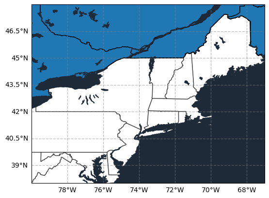

Figure 1: A sample of the mask created to disregard the data in Canada

### [Aggregates](https://github.com/JStiles9552/CLIM_680_Project/blob/9c1679d76a9cd58046eefff4859a4a8beefb7271/Aggregates.ipynb)

Over the entire time span, the average daily precipitation was around 3.32 mm/day for the entire area of land, with a standard deviation of around 1.51. These values were calculated using the mean and standard deviation functions in numpy, and included the total precipitation values over the entire 1990-2010 time span. I also calculated the mean values of daily precipitation throughout the entire Northeast U.S. for each year between 1990-2010, as this was an effective method of quickly discovering any trends throughout this time span. Figure 2 displays a simple line plot trend of these mean values. Another effective method of calculating aggregates was to create a contour plot of the average daily precipitation values thorugh the entire time span. Figure 3 shows the mean total precipitation spread throughout the entire Northeast U.S., with a color scale of 2.5-4.5 mm/day that includes all the mean values.

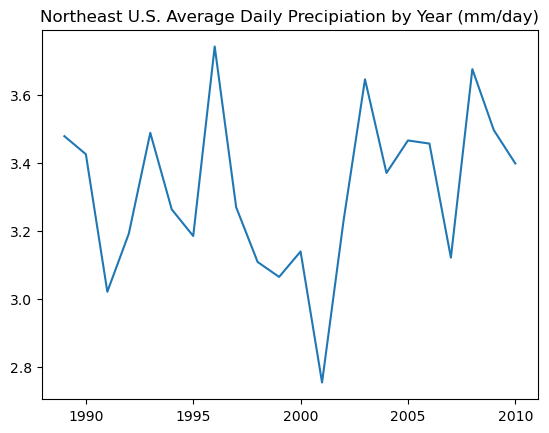

Figure 2: The average trend of daily precipitation for the entire Northeast U.S. between 1990-2010

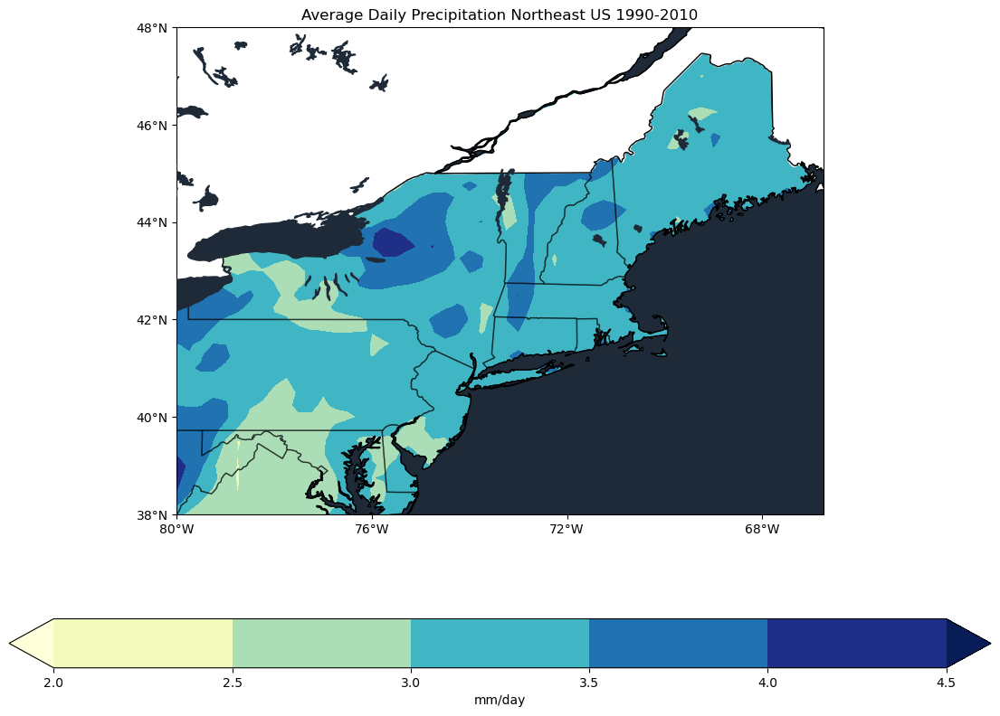

Figure 3: Average Daily Precipitation for the Northeast U.S. between 1990-2010

### [Groupby](https://github.com/JStiles9552/CLIM_680_Project/blob/34a631aca9839ba6185632da966e098612d61e89/Groupby.ipynb)

In order to show the monthly spread of daily precipitation values, I created a 12-Month climatology plot for the Northeast U.S. This was accomplished by using the groupby function to separate the data by month, and then applying this to the pyplot package in matplotlib to display the monthly data on a 6 column, 2 row plot. This allows me to display the monthly changes in daily precipitation values, and also helps to decipher which months show the least and greatest precipitation. Figure 4 displays this 12-Month Climatology plot, with the daily precipitation value spread changing radically with each month.

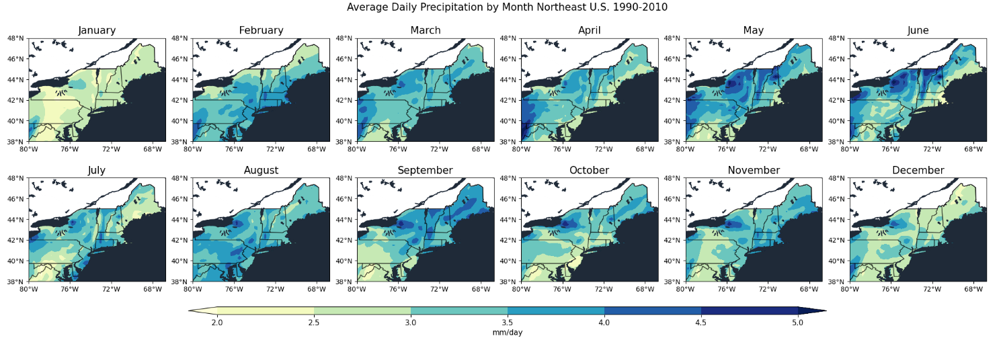

Figure 4: 12-Month Climatology for the Northeast U.S.

I also completed a Seasonal Climatology plot for the Northeast U.S. to show the seasonal change in average tp values. The cold months of December, January, and February (DJF) in particular would be useful later on with my composite, so it made sense to show an initial plot of the precipitation during this season. I completed this by using groupby to separate the data by season, and then using the same process as before to display the data in a 2 column, 2 row plot. Figure 5 shows this seasonal plot, as well as how the daily precipitation in the Northeast U.S. was affected by the seasonal change.

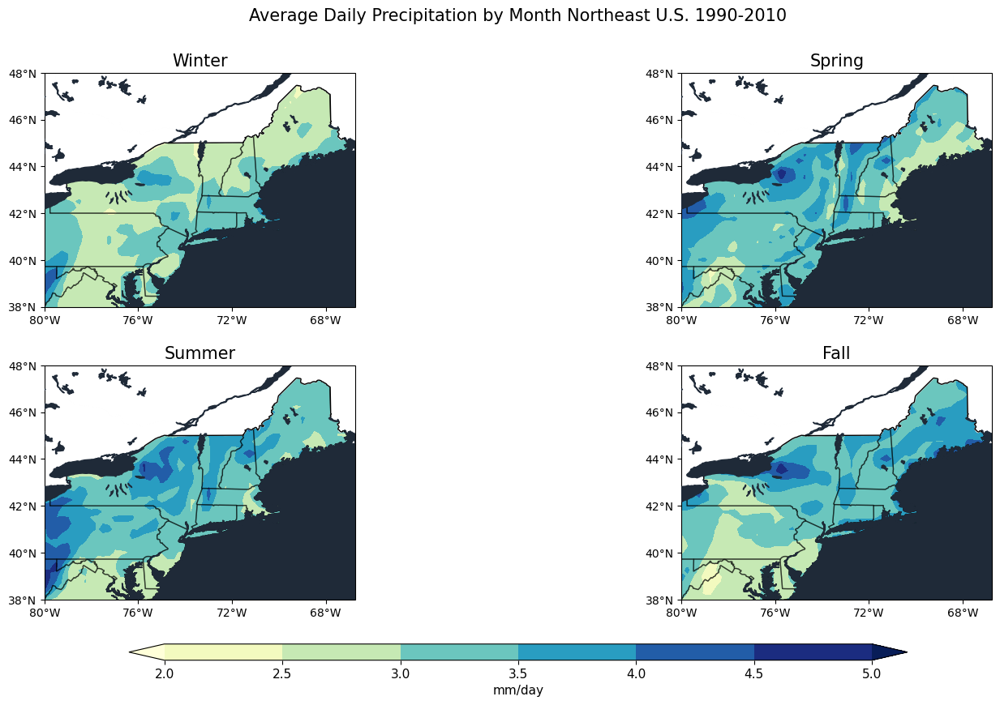

Figure 5: Seasonal Climatology for the Northeast U.S.

### [Anomalies](https://github.com/JStiles9552/CLIM_680_Project/blob/5ecfb0b51b3fd2cf96afcb55011a1dad6c58537b/Anomalies.ipynb)

Now that I could determine which areas showed the highest and lowest values of tp, I then calculated and plotted anomalies for these specific areas. The first region I focused on was Washington, D.C., as it showed one of the lowest average precipitation values out of the entire Northeast U.S., and also because it made sense to explore the trends of a nearby area. By selecting the latitude and longitude values of 39N, -77W, this disregarded any data outside of Washington, D.C. and I could then create a line plot of all the tp values between 1990-2010. Figure 6 displays the plot over the entire time span and constantly increasing and decreasing tp values. However, this does not display the anomalies, so I created a second array that contained the monthly average tp values for the entire Northeast U.S. and subtracted it from the monthly average tp values for Washington, D.C. I then completed the same process as before to display these anomalies on a line plot, and followed that up by adding both a 1 year and 10 year running mean plot as this was an effective way of showing long term trends. Figure 7 shows these three plots over the entire 1990-2010 time span, with the anomalies becoming weaker (closer to zero) as the running mean increases in length of time.

Figure 6: Daily Precipitation Trend for Washington D.C. between 1990-2010

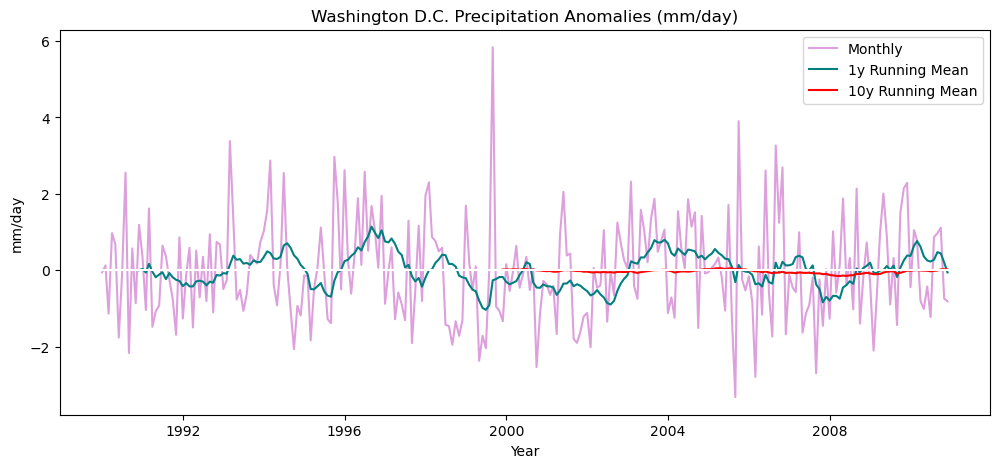

Figure 7: Daily Precipitation Anomalies by month for Washington D.C. between 1990-2010

The next area I chose was the region that showed the highest tp values, which was a section of New York just east of Lake Ontario. For this section, I used the longitude value of 75.5W and the latitude value of 43.5N to give an approximation for all of the high tp values in this region. I then completed the same process as with Washington D.C to plot the yearly anomalies along with the 1 year and 10 year running mean plots. Figure 8 displays these plots in the same manner as Figure 7, but shows a large difference in the spread of anomalies due to the higher tp values.

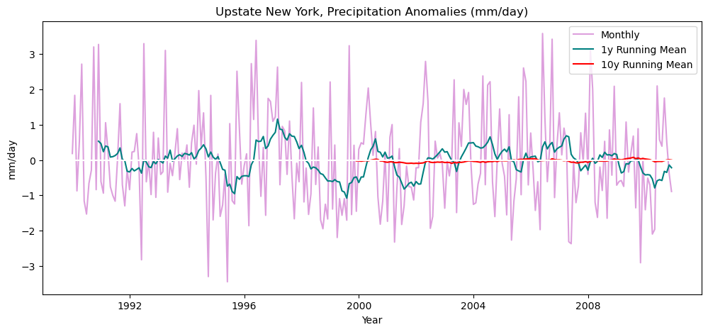

Figure 8: Daily Precipitation Anomalies by month for Upstate New York between 1990-2010

The final area I chose was Boston (MA), with the main motivation being that it is located further north and close to the Atlantic Ocean. I used the latitude and longitude values of 42.5N and 71W, and once again applied them to the same code as in the previous anomalies. Figure 9 displays how the anomalies for Boston were observed, as well as how they compare to the two previous situations.

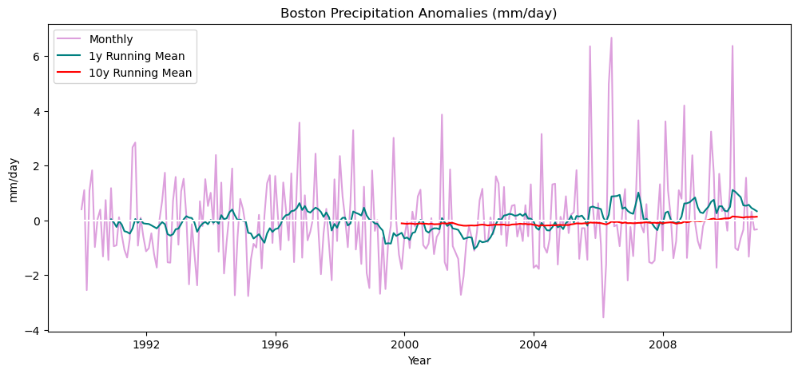

Figure 9: Daily Precipitation Anomalies by month for Boston between 1990-2010

### [Composite with the North Atlantic Oscillation](https://github.com/JStiles9552/CLIM_680_Project/blob/c1b90e3674b86b86a494164981682ebbac290a8e/NAO_Composite.ipynb)

To account for the different phases of the NAO, I decided to focus on the extreme NAO index values and assigned them to two different arrays, those being "positivenao" and "negativenao," with everything in between being "nuetralnao." The positivenao array was made up of all values of nao greater than 0.7 and the negativenao array contained all values less than -0.7, with everything in between compising the neutralnao array. The reason I chose thresholds other than zero is because a threshold of zero showed very little correlation in the significance test, so I changed the thresholds to be well above or well below zero to increase the significance. Also, I grouped both my dataset and the climate index by year for the composite, because my dataset is scaled on an abnormal time scale (i.e., dates are classified like 12-31-1989T18:00:00) that would not allow it to match with the index. Finally, my composite only included the cold weather months of December, January, and February, as the NAO has been examined to show the greatest impact during these months (Hurrell et al, 2003). I accomplished this by placing the seasons for the entire time span of the composite into groups, and then selecting the groups for DJF so the index would only account for the cold months within the composite. I then did the same thing for my dataset so it would match with the index, and followed up by calculating the anomaly values within my dataset by subtracting the mean values from the average daily precipitation during DJF by year. Figure 10 shows the line plot trend of the NAO between 1950-2020, with the red shades representing the Positive NAO, the green shades accounting for the Neutral phase, and the blue shades representing the Negative NAO. In this case, I am interested in looking at the extreme positive and negative events that occurred between 1990-2010, which show the largest distance from zero for this time frame.

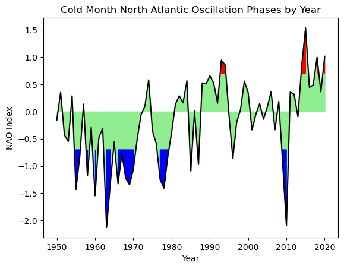

Figure 10: North Atlantic Oscillation Phases between 1950-2020

To complete the composite, I made sure to slice positvenao, neutralnao, and negativenao arrays so they were on the same year scale (1990-2010) as my dataset. I then matched the anomalies of my dataset with the respective phase of the NAO, and finished by plotting each of these respective arrays within the Northeast U.S. with the same mapping features I used in the previous plots. Figure 11 displays the plots of all three NAO phases paired with the anomaly values, with the anomalies changing radically between each plot.

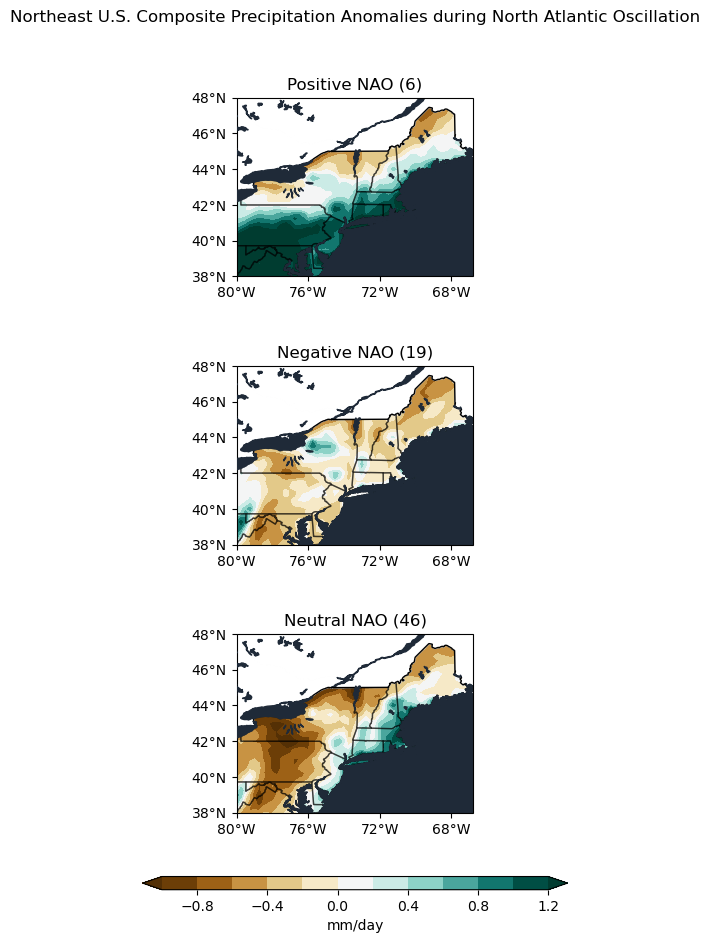

Figure 11: Daily Precipitation Anomalies during Postive, Neutral, and Negative NAO phases between 1990-2010

After completing the composite, the next step was performing a t-test to show the signficance between the anomalies and the NAO index. This was done by matching all the anomaly values with the respective years of positve, negative or neutral NAO, and then performing the test between the positve and neutral NAO values with a p-value of 0.05 (5%) to the show the significance of the anomalies in an extreme Positive NAO event from a Neutral NAO event. By then creating a mask of the significant values calculated in the t-test, I was able to plot the areas of significance for the precipitation anomalies associated with the extreme Positive NAO event. Figure 12 displays this mask with the Positive NAO plot, where the areas with the dots represent the areas of significance.

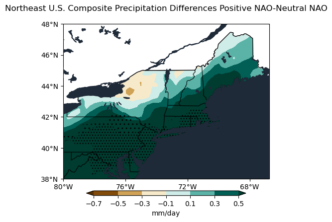

Figure 12: Daily Precipitation Anomaly Differences between Positive and Neutral NAO phases between 1990-2010

### [Python Function](https://github.com/JStiles9552/CLIM_680_Project/blob/7dd4284373bc9d3cfcba29a1b4edc7c613bdd57f/Python_Function.ipynb)

The python function I created was a simplified method of calculating mean tp values on different time intervals. The function was defined as mean_lat_lon_year, and it depended on the variables of latitude and longitude. Within the function definition, I grouped my dataset by mean tp values based on year, and then used this grouped dataset to specify that the function is selecting mean tp values at a certain location of latitude (x) and longitude (y). Based on this, I could then return any array of mean tp values by year at any location within the Northeast U.S., which is very helpful in quickly calculating these values. In addition, I created a similar function that would return mean values in a monthly array, which works in the same way as the previous function.

### [Linear Regression](https://github.com/JStiles9552/CLIM_680_Project/blob/87560e24068c3f4bc6b16cd7c210210eceaf7b9b/NAO_Linear_Regression.ipynb)

To compute my Linear Regression, I used the same NAO climate index as the one in my composite. I also continued the process of grouping the index by season and only selecting the cold months (DJF), and then completed the same grouping process for my dataset. Following this, I was able to compute the anomalies by year that I would use within the regression model. When I computed the regression, I assigned the DJF climate index to the independent variable and the DJF dataset to the dependent variable, and then calculated the regression coefficient at every location within the latitude and longitude range. Finally, I plotted the regression coefficient spread throughout the Northeast U.S., as seen in Figure 7.

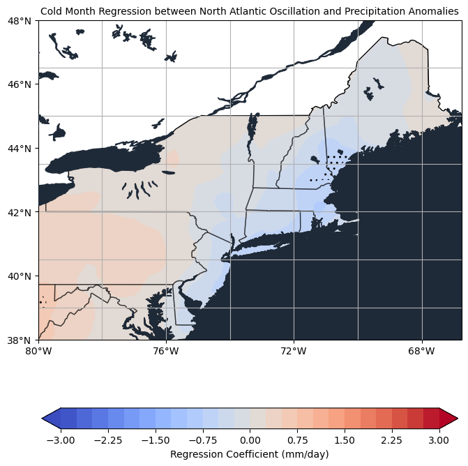

Figure 13: Linear Regression Plot between Cold Month NAO and the Daily Precipitation Anomalies

## Results

To begin the results analysis, I will cover the major aggregates. The standard deviation value of 1.5 is rather high, which indicates that the precipitation values are very fronloaded based on the mean value of 3.31, and that there is a large variation in daily precipiation values throughout the Northeast U.S. In terms of the year-by-year line plot of average tp values (Figure 2), the only noticeable trend is a steep decrease in average precipitation between the late 1990s to early 2000s. Other than that, the trend is rather uniform around 3.2-3.4 mm/day without any long term increases or decreases in the trend. Finally, the total average tp contour plot (Figure 3) shows that the areas of Upstate New York just east of Lake Ontario saw the highest average daily precipitation, while locations around Washington, D.C., Central Maryland, and Northern Virginia experienced the lowest average precipitation.

When looking at the 12-Month Climatology plot (Figure 4), there are a number of discernable trends. The month of January shows the lowest values of average daily precipitation throughout the region, as there are very few locations with average values above 3.0 mm/day. The months of May and June display the largest spread of high tp values, with large portions of New York, New Hampshire, and Vermont experiencing values above 4.5 mm/day. This climatology plot further explains the total average tp contour plot, as the area just east of Lake Ontario consistently displays the highest tp values throughout the entire region. Also, Northern Virginia, Maryland, and Washington D.C. constistently show the lowest tp values, with only February, April, and August displaying values 3.0 mm/day or greater. Moving to the Seasonal Climatology plot (Figure 5), summer is the month that displays the largest spread of high tp values, indicating that summer was the season with the most consistently high precipitation throughout the Northeast U.S. As for winter, this is the season with the lowest tp values, with only Upstate New York showing moderately high precipitation during this season.

Moving to the calculated anomalies, Washington D.C. (Figure 7) and Upstate New York (Figure 8) show minimal changes in trends. Aside from a strong positive anomaly in the late 1990s followed by strong negative anomalies in the early 2000s, Washington, D.C. shows a uniform up-and-down trend in the anomalies. Upstate New York is relatively the same, but shows even fewer strong anomalies (positive or negative) and no discernable changes in the anomaly trend. As for Boston (Figure 8), there are some observable changes, mainly during the final quarter of the time scale. Looking between the years of 2005-2010, there are multiple strong positive anomalies, as well as an overall trend of favors a short scale increase in precipitation as indicated by the 1 year running mean plot. While this may not necessarily signify an overall increase in precipitation, it does show that the more recent years experienced a greater frequency of high precipitation events.

In terms of the composite, by using the high thresholds of Postive NAO > 0.7 and Negative NAO < -0.7, I was able to find a good amount of correlation between the precipitation anomalies in my dataset and the most extreme NAO events between 1990-2010. The Postive NAO - Neutral NAO plot (Figure 12) shows strong correlation within the southern half of the Northeast U.S., mainly in the states of Pennsylvania, New Jersey, Maryland and Northern Virginia. In the northern half, the correlation is confined to eastern Connecticut, Rhode Island, and southeastern Massachusetts, all of which are located very close to the Atlantic Ocean. Within this correlation, the precipitation anomalies are positive, which indicates a significant relationship between the extreme Positive NAO events and the positive precipitation anomalies.

The calculated linear regression (Figure 13) shows a weak regression coefficient throughout much of the Northeast U.S. The only locations where the regression coefficient is significant are the Atlantic Coastal regions of New Hamsphire and Southeastern Maine which show a strong negative coefficient, as well as the far southeastern section of the Northeast U.S. around northern West Virginia that shows a strong positive coefficient. Because of these calculations, it is likely that the relationship between the cold month Northeast precipitation and total North Atlantic Oscillation is not very significant. The difference between this situation and the composite is that the NAO was not defined under three differnt phases of varying thresholds for the linear regression, instead it was calculated using the full scale of the NAO index as a singular independent variable. This indicates that only the extreme NAO phases (positive or negative) have a significant impact on Northeast U.S. precipitation trends, as there is very little correlation within this regression throughout the region.

## Summary

This project gave me a strong insight into the year by year trends of precipitation in the Northeast U.S. I discovered that winter is the season where this region experiences its least amount of precipitation, even with the heavy snowfall trends that often categorize it. I also learned that the extreme NAO events have a significant impact on precipitation trends within this region, but the less extreme events failed to show a strong (if any) correlation with these trends. While I was able to find evidence of changing precipitation patterns in areas such as Boston, there was not enough evidence to support any conclusions about changing trends over the entire (or even most of the) Northeast U.S. This was the main challenge of this project, as it was impossible to calculate anomalies and year by year trends in daily precipitation for every part of this region. In addition, the linear regression model showed an insignificant result for nearly the entire region even after confining the analysis to the cold months, which indicates that a further analysis of the regression model is necessary going forward. Even though the results are not conclusive enough to show any major changes in total precipitation trends throughout the Northeast U.S., they do provide a good insight into the yearly and seasonal trends, as well as the regional impact of the strong North Atlantic Oscillation events.

## Conda Environment

/home/jstiles4/clim_data3.yml

## References

Hersbach, H, Bell, B, Berrisford, P, et al. (2020). The ERA5 Global Reanalysis. Q J R Meteorol Soc. 2020; 146: 1999– 2049. https://doi.org/10.1002/qj.3803

ECMWF. (n.d.). ERA5. https://www.ecmwf.int/en/forecasts/datasets/reanalysis-datasets/era5

Climate Data Store. (2022). ERA5 Monthly Averaged Data on Single Levels from 1959 to Present. ECMWF & Copernicus Climate Change Service. 
  https://cds.climate.copernicus.eu/cdsapp#!/dataset/reanalysis-era5-single-levels-monthly-means?tab=overview

Hurrell, J.W., Ottersen, G., Kushnir, Y., et al. (2003). An Overview of the North Atlantic Oscillation. AGU.  https://www.researchgate.net/publication/304578504_An_overview_of_the_North_Atlantic_Oscillation

[Project Proposal](https://jstiles9552.github.io/CLIM_680_Project/Project_Proposal.html)

[Project Update](https://jstiles9552.github.io/CLIM_680_Project/Project_Update.html)
